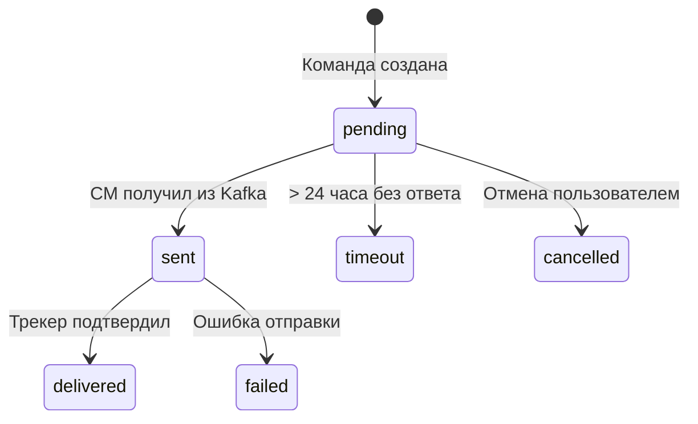

# 🔌 Device Manager — REST API

> Тег: `АКТУАЛЬНО` | Обновлён: `2026-06-02` | Версия: `1.0`

## Base URL

```
http://localhost:8092/api/v1
```

---

## Устройства

### GET /devices — Список устройств

```bash
curl "http://localhost:8092/api/v1/devices?page=1&pageSize=20&status=online"
```

**Query Parameters:**

| Параметр | Тип | Обязателен | Описание |
|----------|-----|-----------|----------|
| `page` | int | нет | Страница (default: 1) |
| `pageSize` | int | нет | Размер страницы (default: 20, max: 100) |
| `status` | string | нет | Фильтр: `online`, `offline`, `alarm` |
| `groupId` | UUID | нет | Фильтр по группе |
| `search` | string | нет | Поиск по IMEI, имени, гос.номеру |

**Response 200:**

```json
{
  "data": [
    {
      "id": "123e4567-e89b-12d3-a456-426614174000",
      "imei": "352093081234567",
      "name": "Грузовик-01",
      "vehicleNumber": "А123BC77",
      "protocol": "teltonika",
      "status": "online",
      "organizationId": "org-uuid",
      "groupId": "group-uuid",
      "speedLimit": 90,
      "lastPosition": {
        "lat": 55.7558,
        "lon": 37.6173,
        "speed": 45,
        "course": 180,
        "timestamp": "2026-06-02T10:30:00Z"
      },
      "createdAt": "2026-01-15T08:00:00Z",
      "updatedAt": "2026-06-01T12:00:00Z"
    }
  ],
  "pagination": {
    "page": 1,
    "pageSize": 20,
    "total": 142,
    "totalPages": 8
  }
}
```

---

### POST /devices — Создать устройство

```bash
curl -X POST http://localhost:8092/api/v1/devices \
  -H "Content-Type: application/json" \
  -d '{
    "imei": "352093081234567",
    "name": "Грузовик-01",
    "vehicleNumber": "А123BC77",
    "protocol": "teltonika",
    "organizationId": "org-uuid",
    "groupId": "group-uuid",
    "speedLimit": 90,
    "fuelTankVolume": 300,
    "iconType": "truck"
  }'
```

**Response 201:**

```json
{
  "id": "123e4567-e89b-12d3-a456-426614174000",
  "imei": "352093081234567",
  "name": "Грузовик-01",
  "createdAt": "2026-06-02T10:30:00Z"
}
```

**Errors:**

| Код | Описание |
|-----|----------|
| 400 | Невалидный IMEI (не 15 цифр) |
| 409 | IMEI уже зарегистрирован |
| 422 | Неизвестный протокол |

---

### GET /devices/{id} — Получить устройство

```bash
curl http://localhost:8092/api/v1/devices/123e4567-e89b-12d3-a456-426614174000
```

**Response 200:** Полный объект `Device` (как в списке, но с дополнительными полями).

---

### PUT /devices/{id} — Обновить устройство

```bash
curl -X PUT http://localhost:8092/api/v1/devices/123e4567-e89b-12d3-a456-426614174000 \
  -H "Content-Type: application/json" \
  -d '{
    "name": "Грузовик-01 (обновлён)",
    "speedLimit": 110,
    "groupId": "new-group-uuid"
  }'
```

**Response 200:** Обновлённый объект `Device`.

---

### DELETE /devices/{id} — Удалить устройство

```bash
curl -X DELETE http://localhost:8092/api/v1/devices/123e4567-e89b-12d3-a456-426614174000
```

**Response 204:** No Content.

---

## Команды

### POST /devices/{id}/commands — Отправить команду

```bash
curl -X POST http://localhost:8092/api/v1/devices/123e4567-e89b-12d3-a456-426614174000/commands \
  -H "Content-Type: application/json" \
  -d '{
    "type": "SetInterval",
    "parameters": {
      "intervalSeconds": 30
    }
  }'
```

**Типы команд:**

| Тип | Параметры | Описание |
|-----|-----------|----------|
| `SetInterval` | `intervalSeconds: Int` | Установить интервал отправки GPS |
| `RequestPosition` | — | Запросить текущую позицию |
| `Reboot` | — | Перезагрузить трекер |
| `BlockEngine` | — | Заблокировать двигатель |
| `UnblockEngine` | — | Разблокировать двигатель |
| `SetServer` | `host: String, port: Int` | Сменить сервер |
| `SetApn` | `apn: String, user: String, password: String` | Настроить APN |
| `SetTimezone` | `offsetHours: Int` | Установить часовой пояс |
| `SendSms` | `phone: String, message: String` | Отправить SMS |
| `CustomCommand` | `raw: String` | Произвольная команда |

**Response 202:**

```json
{
  "commandId": "cmd-uuid",
  "status": "pending",
  "createdAt": "2026-06-02T10:35:00Z"
}
```

---

### GET /devices/{id}/commands — История команд

```bash
curl "http://localhost:8092/api/v1/devices/123e4567-e89b-12d3-a456-426614174000/commands?limit=10"
```

**Response 200:**

```json
{
  "data": [
    {
      "id": "cmd-uuid",
      "type": "SetInterval",
      "parameters": { "intervalSeconds": 30 },
      "status": "delivered",
      "createdAt": "2026-06-02T10:35:00Z",
      "sentAt": "2026-06-02T10:35:01Z",
      "deliveredAt": "2026-06-02T10:35:02Z"
    }
  ]
}
```

**Жизненный цикл статуса команды:**



---

### GET /devices/{id}/commands/{commandId} — Статус команды

```bash
curl http://localhost:8092/api/v1/devices/{id}/commands/{commandId}
```

---

## Группы

### GET /groups — Список групп

```bash
curl http://localhost:8092/api/v1/groups
```

**Response 200:**

```json
{
  "data": [
    {
      "id": "group-uuid",
      "name": "Грузовики",
      "parentId": null,
      "deviceCount": 25,
      "children": [
        {
          "id": "child-uuid",
          "name": "Грузовики > Москва",
          "parentId": "group-uuid",
          "deviceCount": 10,
          "children": []
        }
      ]
    }
  ]
}
```

---

### POST /groups — Создать группу

```bash
curl -X POST http://localhost:8092/api/v1/groups \
  -H "Content-Type: application/json" \
  -d '{
    "name": "Автобусы",
    "parentId": null
  }'
```

---

### PUT /groups/{id} — Обновить группу

### DELETE /groups/{id} — Удалить группу

---

## Системные endpoints

### GET /health

```bash
curl http://localhost:8092/health
```

```json
{
  "status": "ok",
  "service": "device-manager",
  "version": "1.0.0",
  "checks": {
    "database": "ok",
    "redis": "ok",
    "kafka": "ok"
  }
}
```

### GET /metrics

Prometheus метрики (см. [RUNBOOK.md](RUNBOOK.md)).

---

## Коды ошибок

| HTTP код | Тело | Описание |
|----------|------|----------|
| 400 | `{"error": "invalid_request", "message": "..."}` | Невалидный запрос |
| 401 | `{"error": "unauthorized"}` | Нет авторизации |
| 403 | `{"error": "forbidden"}` | Нет прав (чужая организация) |
| 404 | `{"error": "not_found", "message": "Device not found"}` | Ресурс не найден |
| 409 | `{"error": "conflict", "message": "IMEI already registered"}` | Конфликт |
| 422 | `{"error": "validation_error", "details": [...]}` | Ошибка валидации |
| 500 | `{"error": "internal_error"}` | Внутренняя ошибка |
