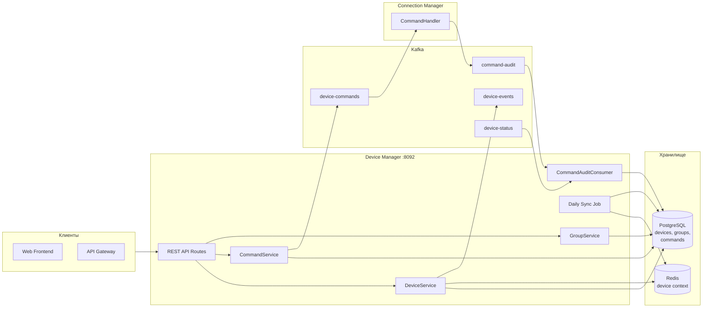
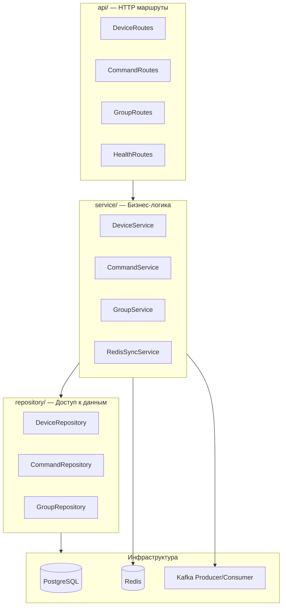
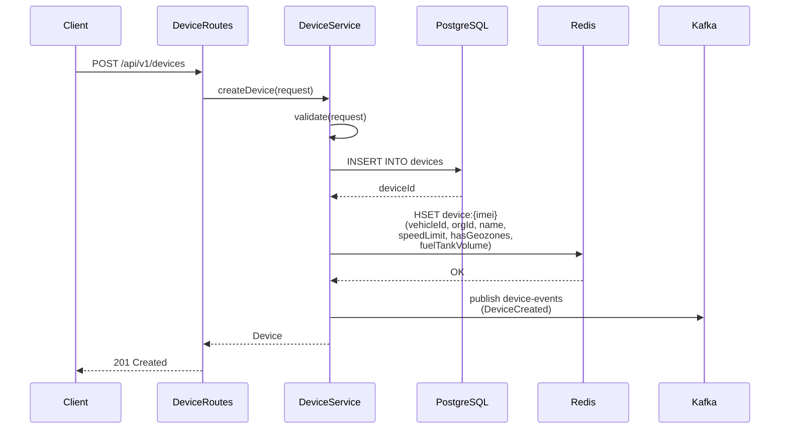
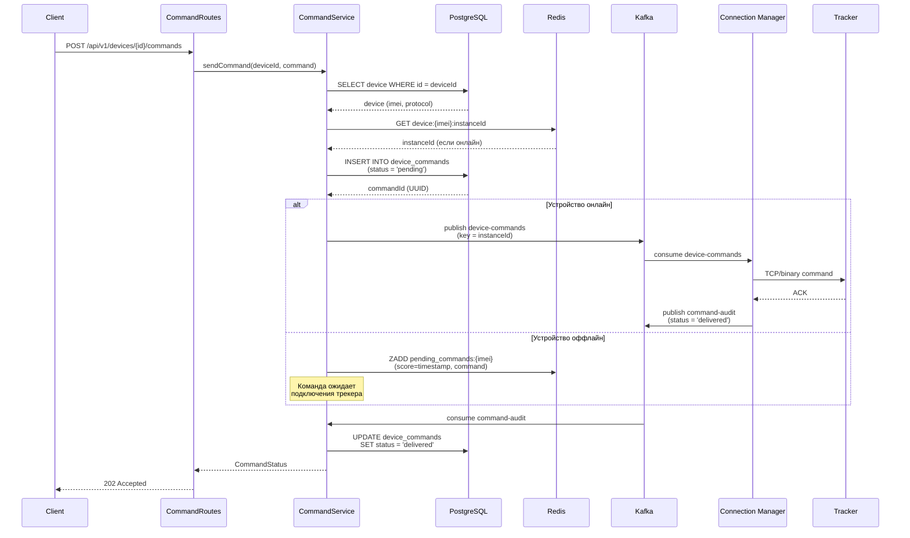
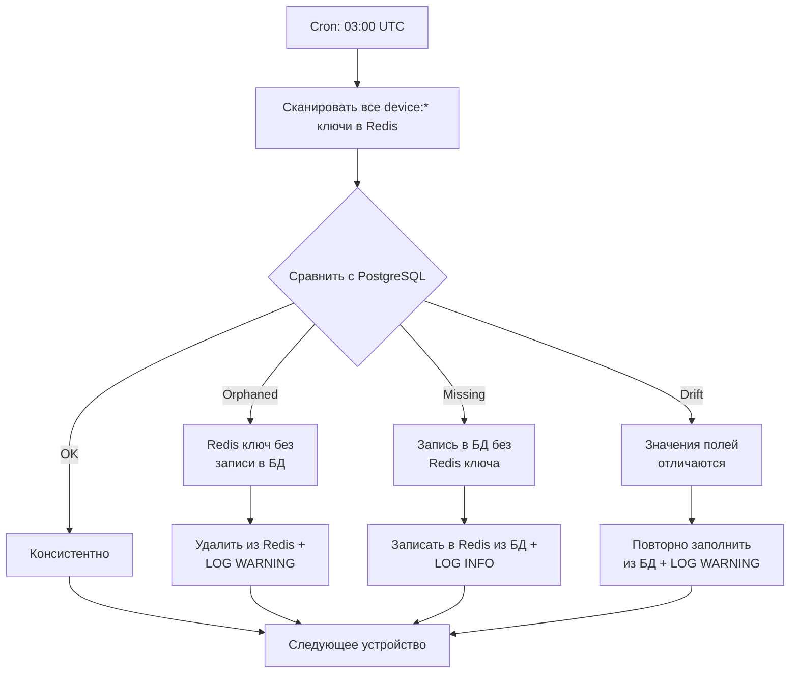

# 🏗 Device Manager — Архитектура

> Тег: `АКТУАЛЬНО` | Обновлён: `2026-06-02` | Версия: `1.0`

## Обзор

Device Manager — REST-сервис для управления GPS-трекерами. Обеспечивает CRUD устройств,
отправку команд на трекеры через Kafka → Connection Manager, и синхронизацию контекста
устройств в Redis.

## Общая диаграмма



## Слои сервиса



## Поток создания устройства



## Поток отправки команды



## Ежедневная синхронизация Redis ↔ PostgreSQL



## Структура пакетов

```
com.wayrecall.tracker.devicemanager/
├── Main.scala                    # Точка входа, ZIO Layer composition
├── domain/
│   ├── Device.scala              # case class Device, Protocol enum
│   ├── DeviceGroup.scala         # case class DeviceGroup (hierarchical)
│   ├── Command.scala             # sealed trait Command (10 типов)
│   ├── DeviceCommand.scala       # case class DeviceCommand (status lifecycle)
│   └── DeviceError.scala         # sealed trait DeviceError
├── config/
│   └── AppConfig.scala           # Конфигурация сервиса (HOCON)
├── service/
│   ├── DeviceService.scala       # CRUD устройств + Redis sync
│   ├── CommandService.scala      # Отправка и отслеживание команд
│   ├── GroupService.scala        # Управление группами
│   └── RedisSyncService.scala    # Ежедневная синхронизация
├── repository/
│   ├── DeviceRepository.scala    # Doobie queries для devices
│   ├── CommandRepository.scala   # Doobie queries для device_commands
│   └── GroupRepository.scala     # Doobie queries для device_groups
├── api/
│   ├── DeviceRoutes.scala        # REST: /api/v1/devices
│   ├── CommandRoutes.scala       # REST: /api/v1/devices/{id}/commands
│   ├── GroupRoutes.scala         # REST: /api/v1/groups
│   └── HealthRoutes.scala        # GET /health, /metrics
├── kafka/
│   ├── CommandProducer.scala     # Publish device-commands
│   ├── EventProducer.scala       # Publish device-events
│   └── AuditConsumer.scala       # Consume command-audit, device-status
├── storage/
│   └── RedisClient.scala         # Redis HASH операции для device context
└── util/
    └── Pagination.scala          # Пагинация API ответов
```

## ZIO Layer Composition

```scala
// Main.scala — упрощённая схема
val appLayer: ZLayer[Any, Throwable, AppEnv] =
  // Конфигурация
  AppConfig.live ++
  // Инфраструктура
  PostgresDataSource.live ++
  DoobieTransactor.live ++
  RedisClient.live ++
  KafkaProducer.live ++
  KafkaConsumer.live ++
  // Репозитории
  DeviceRepository.live ++
  CommandRepository.live ++
  GroupRepository.live ++
  // Сервисы
  DeviceService.live ++
  CommandService.live ++
  GroupService.live ++
  RedisSyncService.live ++
  // API
  DeviceRoutes.live ++
  CommandRoutes.live ++
  GroupRoutes.live ++
  HealthRoutes.live
```
