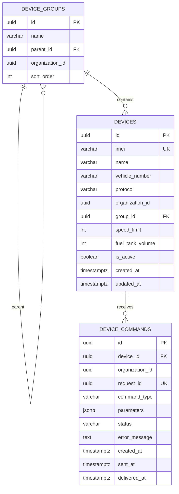

# 💾 Device Manager — Модель данных

> Тег: `АКТУАЛЬНО` | Обновлён: `2026-06-02` | Версия: `1.0`

## PostgreSQL (схема `devices`)

### Таблица: devices

```sql
CREATE TABLE devices (
    id                UUID PRIMARY KEY DEFAULT gen_random_uuid(),
    imei              VARCHAR(15) NOT NULL UNIQUE,
    name              VARCHAR(255) NOT NULL,
    vehicle_number    VARCHAR(20),
    protocol          VARCHAR(50) NOT NULL,           -- teltonika, wialon_ips, ruptela, navtelecom
    organization_id   UUID NOT NULL,
    group_id          UUID REFERENCES device_groups(id),
    speed_limit       INTEGER DEFAULT 90,             -- км/ч
    fuel_tank_volume  INTEGER,                        -- литры
    icon_type         VARCHAR(50) DEFAULT 'car',
    has_geozones      BOOLEAN DEFAULT false,
    has_speed_rules   BOOLEAN DEFAULT false,
    is_active         BOOLEAN DEFAULT true,
    created_at        TIMESTAMPTZ NOT NULL DEFAULT NOW(),
    updated_at        TIMESTAMPTZ NOT NULL DEFAULT NOW(),

    CONSTRAINT valid_protocol CHECK (
        protocol IN ('teltonika', 'wialon_ips', 'ruptela', 'navtelecom')
    ),
    CONSTRAINT valid_imei CHECK (length(imei) = 15 AND imei ~ '^[0-9]+$')
);

-- Индексы
CREATE INDEX idx_devices_imei ON devices(imei);
CREATE INDEX idx_devices_org ON devices(organization_id);
CREATE INDEX idx_devices_group ON devices(group_id);
CREATE INDEX idx_devices_active ON devices(is_active) WHERE is_active = true;
CREATE INDEX idx_devices_protocol ON devices(protocol);

-- Триггер обновления updated_at
CREATE TRIGGER trg_devices_updated_at
    BEFORE UPDATE ON devices
    FOR EACH ROW EXECUTE FUNCTION update_updated_at();
```

---

### Таблица: device_groups

```sql
CREATE TABLE device_groups (
    id                UUID PRIMARY KEY DEFAULT gen_random_uuid(),
    name              VARCHAR(255) NOT NULL,
    parent_id         UUID REFERENCES device_groups(id),
    organization_id   UUID NOT NULL,
    sort_order        INTEGER DEFAULT 0,
    created_at        TIMESTAMPTZ NOT NULL DEFAULT NOW(),
    updated_at        TIMESTAMPTZ NOT NULL DEFAULT NOW()
);

-- Индексы
CREATE INDEX idx_groups_org ON device_groups(organization_id);
CREATE INDEX idx_groups_parent ON device_groups(parent_id);

-- Представление: дерево групп с количеством устройств
CREATE VIEW device_group_tree AS
WITH RECURSIVE group_tree AS (
    SELECT id, name, parent_id, organization_id, 0 as depth
    FROM device_groups WHERE parent_id IS NULL
    UNION ALL
    SELECT g.id, g.name, g.parent_id, g.organization_id, gt.depth + 1
    FROM device_groups g JOIN group_tree gt ON g.parent_id = gt.id
)
SELECT gt.*, COUNT(d.id) as device_count
FROM group_tree gt
LEFT JOIN devices d ON d.group_id = gt.id AND d.is_active = true
GROUP BY gt.id, gt.name, gt.parent_id, gt.organization_id, gt.depth;
```

---

### Таблица: device_commands

```sql
CREATE TABLE device_commands (
    id                UUID PRIMARY KEY DEFAULT gen_random_uuid(),
    device_id         UUID NOT NULL REFERENCES devices(id),
    organization_id   UUID NOT NULL,
    request_id        UUID NOT NULL UNIQUE,            -- UUID для идемпотентности
    command_type      VARCHAR(50) NOT NULL,             -- SetInterval, Reboot, BlockEngine...
    parameters        JSONB,                           -- {"intervalSeconds": 30}
    status            VARCHAR(20) NOT NULL DEFAULT 'pending',
    error_message     TEXT,
    created_at        TIMESTAMPTZ NOT NULL DEFAULT NOW(),
    sent_at           TIMESTAMPTZ,
    delivered_at      TIMESTAMPTZ,
    failed_at         TIMESTAMPTZ,
    created_by        UUID,                            -- пользователь, создавший команду

    CONSTRAINT valid_status CHECK (
        status IN ('pending', 'sent', 'delivered', 'failed', 'timeout', 'cancelled')
    )
);

-- Индексы
CREATE INDEX idx_commands_device ON device_commands(device_id);
CREATE INDEX idx_commands_status ON device_commands(status);
CREATE INDEX idx_commands_created ON device_commands(created_at DESC);
CREATE INDEX idx_commands_request_id ON device_commands(request_id);
CREATE INDEX idx_commands_org ON device_commands(organization_id);
```

---

## Flyway миграции

```
src/main/resources/db/migration/
├── V1__create_devices_table.sql
├── V2__create_device_groups_table.sql
├── V3__create_device_commands_table.sql
├── V4__add_fuel_tank_volume.sql
└── V5__add_group_tree_view.sql
```

---

## Redis

### Ключ: `device:{imei}` (HASH)

Device Manager является **совладельцем** этого ключа совместно с Connection Manager.

**Поля, записываемые Device Manager (CONTEXT):**

| Поле | Тип | Описание | Пример |
|------|-----|----------|--------|
| `vehicleId` | UUID | ID устройства | `123e4567-...` |
| `organizationId` | UUID | ID организации | `org-uuid` |
| `name` | String | Название | `Грузовик-01` |
| `vehicleNumber` | String | Гос. номер | `А123BC77` |
| `protocol` | String | Протокол | `teltonika` |
| `speedLimit` | Int | Лимит скорости | `90` |
| `hasGeozones` | Boolean | Есть геозоны | `true` |
| `hasSpeedRules` | Boolean | Есть правила скорости | `true` |
| `fuelTankVolume` | Int | Объём бака (литры) | `300` |

**Поля, записываемые Connection Manager (POSITION + CONNECTION):**

| Поле | Тип | Описание |
|------|-----|----------|
| `lat` | Double | Широта |
| `lon` | Double | Долгота |
| `speed` | Int | Скорость (км/ч) |
| `altitude` | Int | Высота (м) |
| `course` | Int | Курс (градусы) |
| `satellites` | Int | Количество спутников |
| `lastPacketTime` | ISO8601 | Время последнего пакета |
| `connectionState` | String | `connected` / `disconnected` |
| `connectedSince` | ISO8601 | Время подключения |
| `instanceId` | String | ID инстанса CM |

**TTL:** без TTL (постоянный ключ, обновляется при каждом пакете).

---

### Ключ: `pending_commands:{imei}` (SORTED SET)

Очередь команд для офлайн-устройств. Score = timestamp создания.

```redis
ZADD pending_commands:352093081234567 1717318500 '{"type":"SetInterval","params":{"intervalSeconds":30}}'
```

**TTL:** 24 часа (команды старше 24 часов автоматически истекают).

**Операции:**
- `ZADD` — при создании команды для оффлайн-устройства
- `ZRANGEBYSCORE` — при подключении устройства (CM читает всё)
- `ZREMRANGEBYSCORE` — после успешной отправки (CM чистит)

---

## Scala domain модели

```scala
package com.wayrecall.tracker.devicemanager.domain

import java.time.Instant
import java.util.UUID

/** Протокол GPS-трекера */
enum Protocol:
  case Teltonika, WialonIps, Ruptela, Navtelecom

/** Статус команды */
enum CommandStatus:
  case Pending, Sent, Delivered, Failed, Timeout, Cancelled

/** Устройство GPS-трекера */
final case class Device(
  id: UUID,
  imei: String,
  name: String,
  vehicleNumber: Option[String],
  protocol: Protocol,
  organizationId: UUID,
  groupId: Option[UUID],
  speedLimit: Int,
  fuelTankVolume: Option[Int],
  iconType: String,
  hasGeozones: Boolean,
  hasSpeedRules: Boolean,
  isActive: Boolean,
  createdAt: Instant,
  updatedAt: Instant
)

/** Команда на трекер */
sealed trait Command
object Command:
  case class SetInterval(intervalSeconds: Int) extends Command
  case object RequestPosition extends Command
  case object Reboot extends Command
  case object BlockEngine extends Command
  case object UnblockEngine extends Command
  case class SetServer(host: String, port: Int) extends Command
  case class SetApn(apn: String, user: String, password: String) extends Command
  case class SetTimezone(offsetHours: Int) extends Command
  case class SendSms(phone: String, message: String) extends Command
  case class CustomCommand(raw: String) extends Command

/** Запись о команде в БД */
final case class DeviceCommand(
  id: UUID,
  deviceId: UUID,
  organizationId: UUID,
  requestId: UUID,
  commandType: String,
  parameters: Option[String],  // JSON
  status: CommandStatus,
  errorMessage: Option[String],
  createdAt: Instant,
  sentAt: Option[Instant],
  deliveredAt: Option[Instant],
  failedAt: Option[Instant],
  createdBy: Option[UUID]
)

/** Группа устройств */
final case class DeviceGroup(
  id: UUID,
  name: String,
  parentId: Option[UUID],
  organizationId: UUID,
  sortOrder: Int,
  createdAt: Instant,
  updatedAt: Instant
)

/** Типизированные ошибки */
sealed trait DeviceError
object DeviceError:
  case class NotFound(id: UUID) extends DeviceError
  case class ImeiAlreadyExists(imei: String) extends DeviceError
  case class InvalidImei(imei: String) extends DeviceError
  case class InvalidProtocol(protocol: String) extends DeviceError
  case class GroupNotFound(id: UUID) extends DeviceError
  case class CommandFailed(commandId: UUID, reason: String) extends DeviceError
  case class OrganizationMismatch(expected: UUID, actual: UUID) extends DeviceError
```

---

## ER-диаграмма


