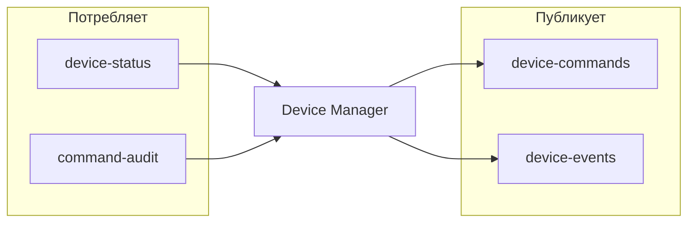

# 📨 Device Manager — Kafka интеграция

> Тег: `АКТУАЛЬНО` | Обновлён: `2026-06-02` | Версия: `1.0`

## Обзор

Device Manager взаимодействует с 4 Kafka топиками: 1 на потребление, 3 на публикацию.



Полное описание всех топиков: [infra/kafka/TOPICS.md](../../../infra/kafka/TOPICS.md)

---

## Потребляемые топики

### `device-status`

| Параметр | Значение |
|----------|----------|
| **Consumer Group** | `device-manager-status` |
| **Partitions** | 12 |
| **Key** | `deviceId` |
| **Назначение** | Обновление статуса устройства (online/offline) |

**Формат сообщения:**

```json
{
  "eventId": "uuid",
  "deviceId": "uuid",
  "imei": "352093081234567",
  "status": "connected",
  "instanceId": "cm-instance-1",
  "timestamp": "2026-06-02T10:30:00Z"
}
```

**Обработка:**
- `connected` → обновить `status = online` в БД, обновить метрики
- `disconnected` → обновить `status = offline` в БД

---

### `command-audit`

| Параметр | Значение |
|----------|----------|
| **Consumer Group** | `device-manager-audit` |
| **Partitions** | 12 |
| **Key** | `deviceId` |
| **Назначение** | Обновление статуса команд после обработки Connection Manager |

**Формат сообщения:**

```json
{
  "eventId": "uuid",
  "requestId": "cmd-uuid",
  "deviceId": "uuid",
  "status": "delivered",
  "errorMessage": null,
  "timestamp": "2026-06-02T10:35:02Z"
}
```

**Обработка:**
- Найти команду по `requestId` в таблице `device_commands`
- Обновить `status`, `sent_at`, `delivered_at`, `failed_at` в зависимости от нового статуса
- При `failed` записать `error_message`

---

## Публикуемые топики

### `device-commands`

| Параметр | Значение |
|----------|----------|
| **Partitions** | 12 |
| **Key** | `instanceId` (Static partitioning для конкретного CM-инстанса) |
| **Retention** | 7 дней |
| **Назначение** | Передача команд на Connection Manager |

**Формат сообщения:**

```json
{
  "requestId": "cmd-uuid",
  "deviceId": "uuid",
  "imei": "352093081234567",
  "protocol": "teltonika",
  "commandType": "SetInterval",
  "parameters": {
    "intervalSeconds": 30
  },
  "createdAt": "2026-06-02T10:35:00Z"
}
```

**Ключ партиции:**
- Если устройство **онлайн**: `key = instanceId` (команда идёт на конкретный инстанс CM, где подключён трекер)
- Если устройство **оффлайн**: команда НЕ публикуется в Kafka, а сохраняется в Redis `pending_commands:{imei}`

---

### `device-events`

| Параметр | Значение |
|----------|----------|
| **Partitions** | 12 |
| **Key** | `deviceId` |
| **Retention** | 30 дней |
| **Назначение** | События жизненного цикла устройств |

**Типы событий:**

```json
// DeviceCreated
{
  "eventType": "DeviceCreated",
  "eventId": "uuid",
  "deviceId": "uuid",
  "imei": "352093081234567",
  "organizationId": "org-uuid",
  "protocol": "teltonika",
  "timestamp": "2026-06-02T10:30:00Z"
}

// DeviceUpdated
{
  "eventType": "DeviceUpdated",
  "eventId": "uuid",
  "deviceId": "uuid",
  "changes": {
    "name": { "old": "Грузовик-01", "new": "Грузовик-01 (обновлён)" },
    "speedLimit": { "old": 90, "new": 110 }
  },
  "timestamp": "2026-06-02T11:00:00Z"
}

// DeviceDeleted
{
  "eventType": "DeviceDeleted",
  "eventId": "uuid",
  "deviceId": "uuid",
  "imei": "352093081234567",
  "timestamp": "2026-06-02T12:00:00Z"
}
```

---

## Порядок сообщений

- **device-commands**: ключ `instanceId` гарантирует, что все команды для одного CM-инстанса обрабатываются последовательно
- **device-events**: ключ `deviceId` гарантирует порядок событий для одного устройства
- **command-audit**: ключ `deviceId` гарантирует порядок аудита для одного устройства
