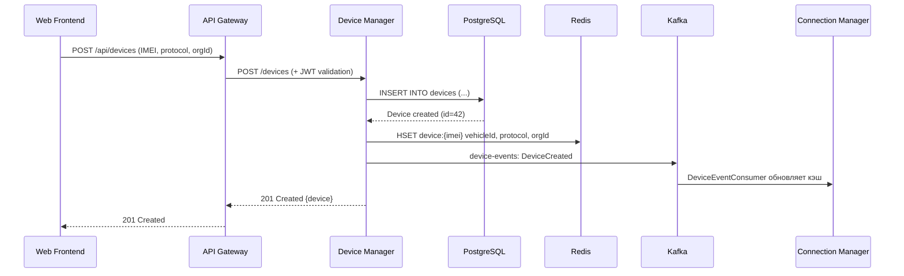
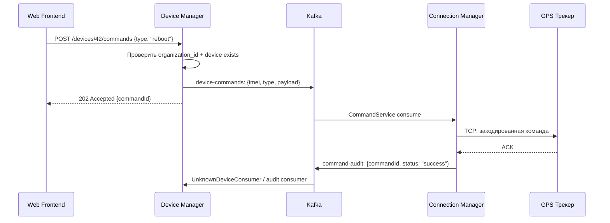
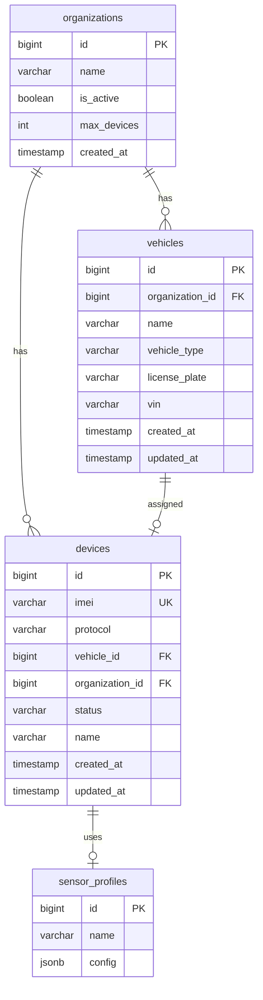

> Тег: `АКТУАЛЬНО` | Обновлён: `2026-03-02` | Версия: `1.0`

# 📖 Изучение Device Manager

> Руководство по устройству Device Manager — сервиса управления устройствами, ТС и организациями.

---

## 1. Назначение сервиса

**Device Manager (DM)** — единственный владелец master data об устройствах. Он:
- Предоставляет REST API для CRUD операций: устройства, транспортные средства, организации
- Привязывает GPS-трекер (IMEI) к транспортному средству  
- Синхронизирует кэш `device:{imei}` в Redis для Connection Manager  
- Отправляет команды на трекеры через Kafka → CM  
- Обрабатывает события о неизвестных устройствах  

**Порт:** 8092 (HTTP REST API)

---

## 2. Архитектура и компоненты

```
REST API (DeviceRoutes) → DeviceService → DeviceRepository (PostgreSQL)
                                       → KafkaPublisher (device-commands, device-events)
                                       → RedisSyncService (device:{imei} → Redis для CM)
```

### Разбор файлов

#### `Main.scala`
- ZIO Layer: AppConfig → TransactorLayer → DeviceRepository → KafkaPublisher → RedisSyncService → DeviceService → Server
- Gratceful shutdown: закрывает Redis/Kafka соединения

#### `api/DeviceRoutes.scala`
- Все REST endpoints с валидацией `organization_id`
- CRUD устройств: POST/GET/PUT/DELETE
- CRUD транспортных средств
- CRUD организаций
- Привязка устройство ↔ ТС
- Отправка команд: `POST /devices/{id}/commands`

#### `consumer/UnknownDeviceConsumer.scala`
- Kafka consumer `unknown-devices`
- CM присылает подключения с неизвестным IMEI → DM логирует и опционально создаёт устройство

#### `domain/Entities.scala`
- Opaque types: `DeviceId`, `VehicleId`, `OrganizationId`, `Imei`, `SensorProfileId`
- `Device`, `Vehicle`, `Organization`, `SensorProfile`, `SensorConfig`
- `enum Protocol`, `enum DeviceStatus`, `enum VehicleType`

#### `domain/Events.scala`
- `sealed trait DeviceEvent`: Created, Updated, Deleted, Activated, Deactivated, AssignedToVehicle, UnassignedFromVehicle
- `sealed trait VehicleEvent`: Created, Updated, Deleted
- `sealed trait OrganizationEvent`: Created, Updated, Deactivated
- `sealed trait DeviceCommand`: EnableDevice, DisableDevice, UpdateImeiMapping

#### `infrastructure/RedisSyncService.scala`
- Использует **lettuce** (как CM) для записи в Redis
- При создании/обновлении/удалении устройства → обновляет `device:{imei}` HASH
- Обеспечивает консистентность: DM пишет → Redis → CM читает

#### `infrastructure/KafkaPublisher.scala`
- `zio-kafka` Producer
- Публикует `device-commands` (для CM), `device-events` (для всех), `command-audit`

#### `repository/DeviceRepository.scala`
- Doobie SQL запросы
- **КРИТИЧНО:** каждый запрос содержит `WHERE organization_id = ?` для multi-tenant изоляции
- CRUD для таблиц: `devices`, `vehicles`, `organizations`, `sensor_profiles`

---

## 3. Domain модель

```scala
// Opaque types — типобезопасные ID
opaque type DeviceId = Long
opaque type VehicleId = Long  
opaque type OrganizationId = Long
opaque type Imei = String       // 15 цифр

case class Device(
  id: DeviceId,
  imei: Imei,
  protocol: Protocol,         
  vehicleId: Option[VehicleId], // Может быть не привязан к ТС
  organizationId: OrganizationId,
  status: DeviceStatus,         // Active / Inactive / Blocked
  name: String,
  description: Option[String],
  sensorProfileId: Option[SensorProfileId],
  createdAt: Instant,
  updatedAt: Instant
)

case class Vehicle(
  id: VehicleId,
  organizationId: OrganizationId,
  name: String,                 // "Газель А001АА77"
  vehicleType: VehicleType,     // Car / Truck / Bus / ...
  licensePlate: Option[String],
  vin: Option[String],
  model: Option[String],
  year: Option[Int],
  fuelTankVolume: Option[Double],
  createdAt: Instant,
  updatedAt: Instant
)

case class Organization(
  id: OrganizationId,
  name: String,
  isActive: Boolean,
  maxDevices: Int,              // Лимит устройств по тарифу
  createdAt: Instant
)
```

---

## 4. Потоки данных

### CRUD устройства



### Отправка команды на трекер



### Схема БД



---

## 5. Kafka топики

### Produce

| Топик | Ключ | Содержимое | Потребители |
|-------|------|------------|-------------|
| `device-commands` | imei | Команды на трекеры | CM (CommandService) |
| `device-events` | deviceId | CRUD события устройств | CM, все сервисы |
| `command-audit` | imei | Аудит команд | DM (самоупотребление) |

### Consume

| Топик | Consumer Group | Обработчик |
|-------|---------------|------------|
| `unknown-devices` | dm-unknown-group | UnknownDeviceConsumer |
| `command-audit` | dm-audit-group | Обновление статуса команды |

---

## 6. База данных

**PostgreSQL** — таблицы: `devices`, `vehicles`, `organizations`, `sensor_profiles`

Flyway миграции: `src/main/resources/db/migration/V1__init.sql`

**Redis (lettuce)** — синхронизация `device:{imei}` для CM

---

## 7. API endpoints

```bash
# Устройства
POST   /devices                    # Создать устройство
GET    /devices                    # Список устройств (фильтр по orgId)
GET    /devices/{id}               # Получить устройство
PUT    /devices/{id}               # Обновить устройство
DELETE /devices/{id}               # Удалить устройство
POST   /devices/{id}/commands      # Отправить команду на трекер

# Транспортные средства
POST   /vehicles                   
GET    /vehicles                   
GET    /vehicles/{id}              
PUT    /vehicles/{id}              
DELETE /vehicles/{id}              

# Привязка устройство ↔ ТС
POST   /devices/{id}/assign/{vehicleId}
POST   /devices/{id}/unassign

# Организации
POST   /organizations              
GET    /organizations              
GET    /organizations/{id}         
PUT    /organizations/{id}         

# Health
GET    /health                     
```

---

## 8. Конфигурация

```hocon
app {
  http.port = 8092
  database {
    url = "jdbc:postgresql://localhost:5432/wayrecall_devices"
    user = "wayrecall"
    password = ${?DB_PASSWORD}
    max-pool-size = 10
  }
  redis {
    host = "localhost"
    port = 6379
  }
  kafka {
    bootstrap-servers = "localhost:9092"
  }
}
```

---

## 9. Как запустить

```bash
# Инфраструктура
docker-compose up -d postgres redis kafka

# Запуск
cd services/device-manager && sbt run

# Проверка
curl http://localhost:8092/health

# Создать организацию
curl -X POST http://localhost:8092/organizations \
  -H "Content-Type: application/json" \
  -d '{"name":"ООО ТрансЛогистика","maxDevices":100}'

# Создать устройство
curl -X POST http://localhost:8092/devices \
  -H "Content-Type: application/json" \
  -H "X-Organization-Id: 1" \
  -d '{"imei":"123456789012345","protocol":"teltonika","name":"Газель-1"}'
```

---

## 10. Типичные ошибки

| Проблема | Причина | Решение |
|----------|---------|---------|
| 403 Forbidden | Нет X-Organization-Id заголовка | Добавить заголовок или проверить Gateway |
| IMEI already exists | Дубликат IMEI | Проверить devices таблицу |
| Redis sync failed | Redis недоступен | Проверить Redis, DM логирует ошибку но не падает |
| Command stuck in pending | CM не подключен к Kafka | Проверить CM health, kafka consumer lag |

---

## 11. Связи с другими сервисами

- **CM** ← читает `device:{imei}` из Redis; получает команды из Kafka
- **History Writer** ← получает `device-events` для обновления метаданных
- **Rule Checker** ← получает информацию об устройствах
- **All services** ← потребляют `device-events` для синхронизации

---

*Версия: 1.0 | Обновлён: 2 марта 2026*
